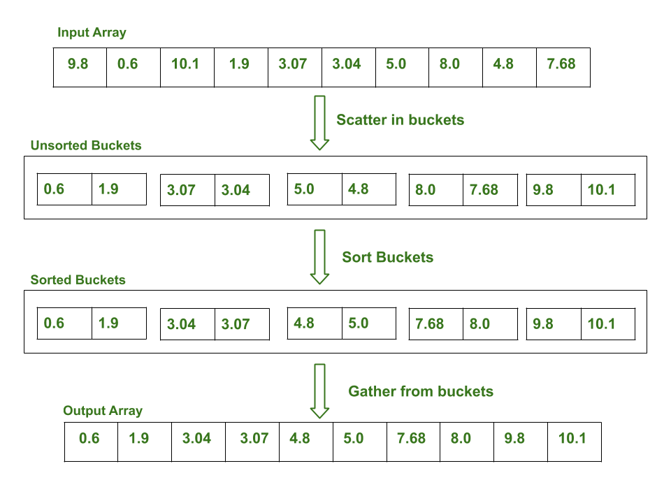

# sort

* [BubbleSort](#BubbleSort)
* [MergeSort](#MergeSort)
* [QuickSort](#QuickSort)
* [BucketSort](#BucketSort)
* insertionSort

## BubbleSort

* [Video](https://www.youtube.com/watch?v=6Gv8vg0kcHc)
* [BubbleSort.java](BubbleSort.java)
* Bubble Sort is the simplest sorting algorithm that works by repeatedly swapping the adjacent elements if they are in wrong order.
  * Worst and Average Case Time Complexity: O(n*n). Worst case occurs when array is reverse sorted.
  * Best Case Time Complexity: O(n). Best case occurs when array is already sorted.
  * Auxiliary Space: O(1)

## MergeSort

* [Video](https://www.youtube.com/watch?v=KF2j-9iSf4Q)
* [MergeSort.java](MergeSort.java)
* Divide and Conquer
  * Divdie
    * divide the input array into half , recursive
  * Conquer
    * merge the two array back into a big one
* Sudo Code
  ```
    MergeSort(arr[], l,  r)
    If r > l
         1. Find the middle point to divide the array into two halves:  
                 middle m = l+ (r-l)/2
         2. Call mergeSort for first half:   
                 Call mergeSort(arr, l, m)
         3. Call mergeSort for second half:
                 Call mergeSort(arr, m+1, r)
         4. Merge the two halves sorted in step 2 and 3:
                 Call merge(arr, l, m, r)
  ```
* Pro
  * guarantee nlog(n)
* Con
  * extra space require (array)

## QuickSort

* [Video](https://www.youtube.com/watch?v=SLauY6PpjW4&t=66s)
* [QuickSort.java](QuickSort.java)
* Divide and Conquer

  * pick a pivot, then partition the pivot
    * move all the element smaller than pivot to the left of the pivot
    * move all the element greater than pivot to the right of the pivot
  * quick sort it around the pivot again
* How to pick pivot

  * Always pick first element as pivot.
  * Always pick last element as pivot (implemented below)
  * Pick a random element as pivot.
  * Pick median as pivot.
* Sudo code

  ```
   /* low  --> Starting index,  high  --> Ending index */
   quickSort(arr[], low, high)
   {
       if (low < high)
       {
           /* pi is partitioning index, arr[pi] is now
              at right place */
           pi = partition(arr, low, high);

           quickSort(arr, low, pi - 1);  // Before pi
           quickSort(arr, pi + 1, high); // After pi
       }
   }

  ```
* RunTime

  * Worst Case : n * n  --> when we need to patition every element in the array
  * Best Case: nlog(n)
  * Average Case : nlog(n)
* Quick sort vs Merge Sort

  * Quick sort is perferred in Array input
    * as Merge Sort will required extra space
  * Merge Sort is perferred in LinkedList input
    * as LinkedList only have adjacent Node access, not random access.

# BucketSort

* [BucketSort.java](BucketSort.java)
* [Video](https://www.youtube.com/watch?v=VuXbEb5ywrU)
* Bucket sort is mainly useful when input is uniformly distributed over a range.

  * input is uniformly distributed over a range.
  * there are floating point values
* Sudo Code

  ```
  bucketSort(arr[], n)
    1.Find maximum element and minimum of the array
    2.Calculate the range of each bucket
        range = (max - min) / n
        n is the number of buckets
    3.Create n buckets of calculated range
    4.Scatter the array elements to these buckets
        BucketIndex = ( arr[i] - min ) / range
    5.Now sort each bucket individually
    6.Gather the sorted elements from buckets to original array
  ```
* 
* Run Time :

  * Best : O(n+k)
  * Worst : depends on the individual sorting algorithms worse case
  * Average : O(n)

# InsertionSort
* [InsertionSort.java](InsertionSort.java)
* [Video](https://www.youtube.com/watch?time_continue=32&v=OGzPmgsI-pQ&feature=emb_logo)
* 
* We can use binary search to reduce the number of comparisons in normal insertion sort. Binary Insertion Sort uses binary search to find the proper location to insert the selected item at each iteration. In normal insertion, sorting takes O(i) (at ith iteration) in worst case. We can reduce it to O(logi) by using binary search.
* Time Complexity: O(nlog(n))
*  Auxiliary Space: O(1)

